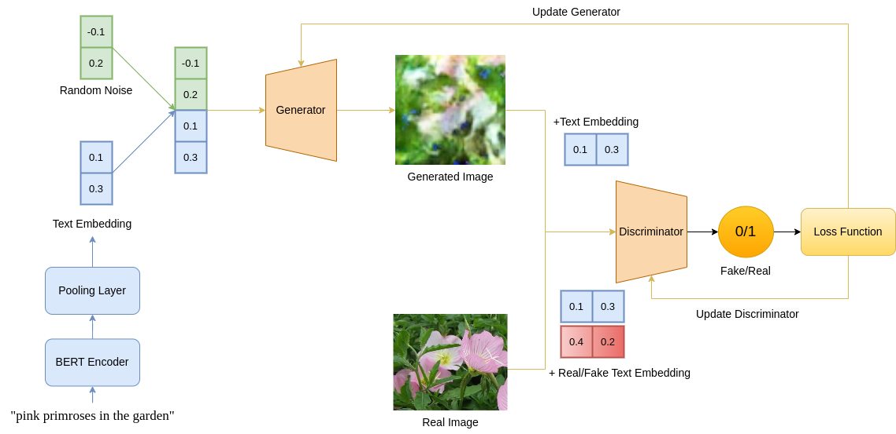
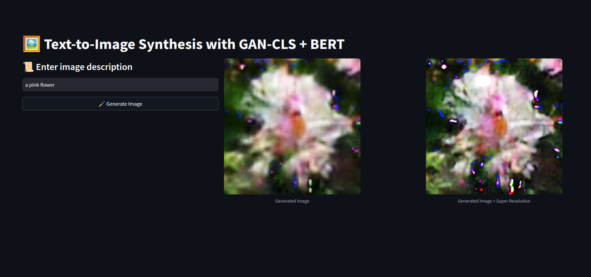

# Text-to-Image Generation using GAN-CLS and BERT

This project implements a Text-to-Image generation model using the GAN-CLS framework combined with a BERT-based text encoder. The model takes a text prompt as input and generates a corresponding image.



## Features

- **GAN-CLS Architecture**: Uses a Conditional GAN to generate images from text descriptions.
- **BERT-based Text Encoder**: Encodes textual input to extract meaningful representations.
- **Streamlit Web App**: Provides an easy-to-use interface for users to input text and view generated images.

## Installation

### Prerequisites

Ensure you have Python 3.8+ installed. Install dependencies using:

```bash
pip install -r requirements.txt
```

## Running the Project Locally

To run the application on your local machine:

1. **Clone the repository**:

   ```bash
   git clone https://github.com/nhanth301/Text2Image-GANCLS-BERT.git
   cd Text2Image-GANCLS-BERT
   ```

2. **Download Pretrained Models**: Place the pretrained model (`generator_bert.pth`) inside the `models/` directory.

3. **Run the Streamlit App**:

   ```bash
   python -m streamlit run app.py
   ```

4. **Access the Web Interface**: Open [http://localhost:8501](http://localhost:8501) in your browser.

## Running Online

You can also access the hosted version of the app at:

🔗 [Live Demo](https://nhanth301-text2image-gancls-bert-app-fqebr9.streamlit.app/)


## Example Usage

1. Enter a text description such as *"a pink water lily in the water with a pink flower"*.
2. Click the **Generate Image** button.
3. The model processes the text and generates an image.

